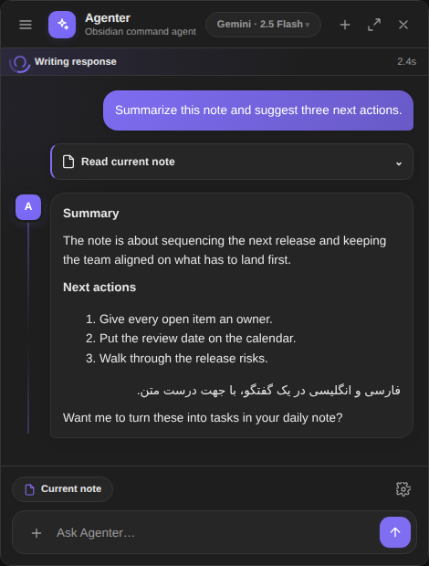
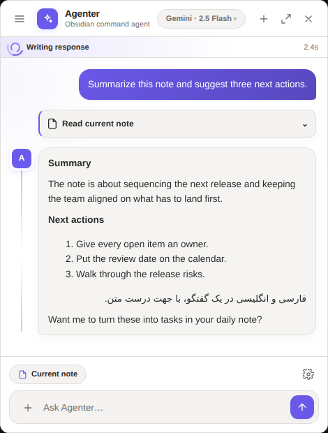
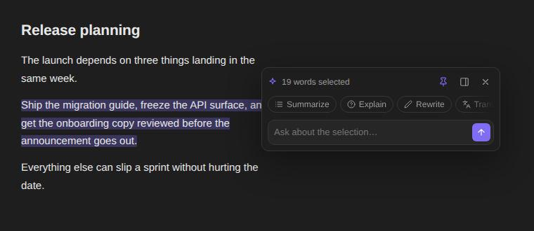
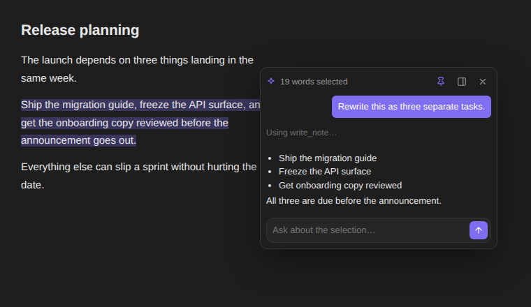
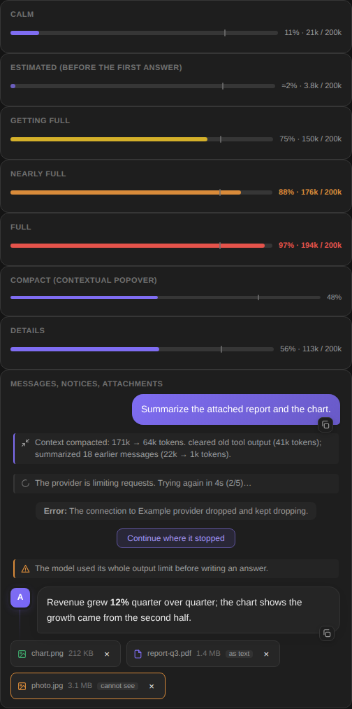
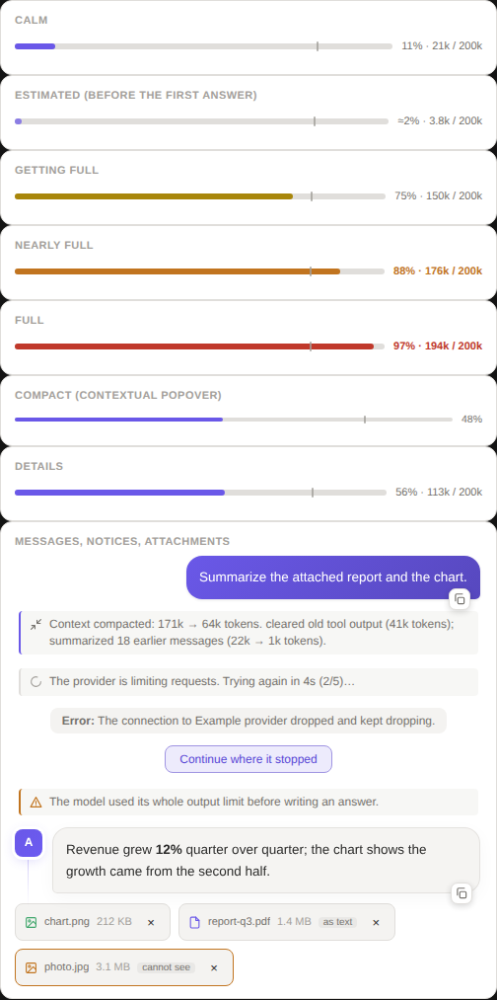
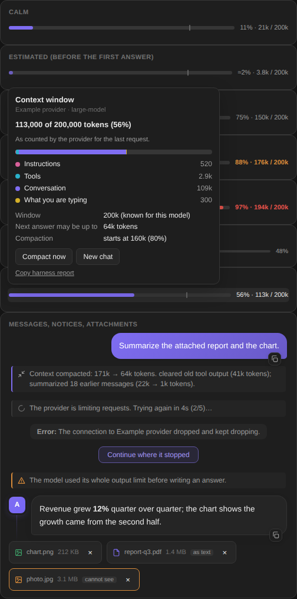

# Agenter

Agenter brings a tool-using AI assistant into Obsidian. Chat in the right
sidebar, a movable floating window, or a compact popover beside the text you
just selected. It can read and search your notes, look things up on the web,
run your own saved prompts, and ask before it changes anything in the vault.

> **Status:** Desktop-only. Agenter is not an AI service — it talks to a
> provider you configure with your own API key.

## What it looks like

The panel is built entirely from Obsidian's theme variables, so it follows the
vault it is installed in:

<table>
<tr>
<td align="center"><b>Dark</b></td>
<td align="center"><b>Light</b></td>
</tr>
<tr>
<td></td>
<td></td>
</tr>
</table>

Selecting text opens the contextual popover — one small card with the selection
collapsed behind its word count, a scrollable row of actions, and a composer:



Ask something and the card turns into the conversation, tool activity and
approval cards included, without growing into a second chat window:



The bar above the composer says how full the model's window is, in whatever
state it is in, and a click opens what the window is made of. Retries,
compaction and attachments leave one quiet line each in the conversation:

<table>
<tr>
<td align="center"><b>Dark</b></td>
<td align="center"><b>Light</b></td>
<td align="center"><b>Details</b></td>
</tr>
<tr>
<td></td>
<td></td>
<td></td>
</tr>
</table>

<sub>These are rendered from the plugin's own `styles.css` and component code
over Obsidian's default theme variables (see
<a href="#previews">Development → Previews</a>), not screenshots of a live
vault.</sub>

## Contents

- [What it looks like](#what-it-looks-like)
- [Features](#features)
- [Requirements](#requirements)
- [Installation](#installation)
- [Setup](#setup)
- [Usage](#usage)
- [The context window and the harness](#the-context-window-and-the-harness)
- [Attachments](#attachments)
- [Copying text](#copying-text)
- [Providers](#providers)
- [Privacy and network access](#privacy-and-network-access)
- [Development](#development)
- [Releasing](#releasing)
- [Security](#security) · [License](#license)

## Features

- **Three chat modes:** docked sidebar, floating window, and a contextual
  popover for the current selection — beside the caret, or pinned to a spot you
  choose once.
- **Multiple providers:** OpenAI, Anthropic, Gemini, OpenRouter, Ollama,
  Cloudflare Workers AI, any OpenAI-compatible service, and custom endpoints.
- **Vault-aware context:** the current note, the current folder, the whole
  vault, or nothing automatic.
- **Tool use:** read and search notes, inspect links and metadata, list
  folders, summarize content, search the web, fetch URLs, and read note images
  when the model supports vision.
- **Guarded note actions:** create, edit, append, move and trash notes only
  after the approval step you configured.
- **Recoverable changes:** note mutations write a safety backup into
  `.agenter-backups`, and deletion goes through Obsidian's recoverable Trash.
- **One conversation:** the main panel and the contextual popover share the
  same history, so you can start in one and continue in the other.
- **Custom prompts:** build reusable prompt actions in settings; they appear in
  the chat and in the popover.
- **Obsidian-native rendering:** replies, note previews, code blocks and
  internal links all go through Obsidian's own Markdown renderer, including
  right-to-left text.
- **Streaming with live status:** watch the answer arrive, stop generation, and
  follow what each tool is doing.
- **No answer cap of its own:** every answer may use as much of the model's
  output as the model allows. A bar shows how full the context window is, and
  long conversations are compacted before they overflow.
- **A harness for every model:** limits learned per model, tool calls repaired
  or read from text, temporary errors retried, loops stopped — so models that
  were fragile elsewhere keep working. See
  [the harness](#the-context-window-and-the-harness).
- **Goes on by itself:** a model that stops in the middle of the job — after
  announcing the next step, writing "part 1 of 3", asking whether to go on, or
  when the connection drops mid-answer — is told to carry on, so you do not
  have to type "continue". See [Going on by itself](#going-on-by-itself).
- **Images, PDFs, Office files and text as attachments**, with a fallback for
  models that cannot see: they get the text, or a description made by another
  provider, or an honest note. PDFs are laid out again from pdf.js's pieces
  (Persian and other right-to-left text included) and long ones are read page by
  page, on request. See [Attachments](#attachments).
- **Everything can be copied:** messages are selectable, each has a copy
  button and a right-click menu, and the whole conversation copies as Markdown.

## Requirements

- Obsidian **1.7.2** or newer (this is the plugin's `minAppVersion`).
- Obsidian Desktop — Agenter is marked `isDesktopOnly`.
- An API key for at least one supported provider, or a local Ollama install.

## Installation

### From Community Plugins

Once Agenter is listed in the Obsidian community directory:

1. Open **Settings → Community plugins**.
2. Select **Browse** and search for **Agenter**.
3. Select **Install**, then **Enable**.

### Manual installation

1. From the [latest release](../../releases/latest), download either
   `agenter-<version>.zip` or the three loose files `main.js`,
   `manifest.json`, and `styles.css`.
2. Create this folder inside your vault:

   ```text
   .obsidian/plugins/agenter/
   ```

3. Unzip the archive into that folder, or copy the three files into it.
4. Restart Obsidian, or reload it.
5. Open **Settings → Community plugins** and enable **Agenter**.

For pre-release testing you can also install the repository with
[BRAT](https://github.com/TfTHacker/obsidian42-brat).

## Setup

1. Open **Settings → Agenter**.
2. Add or edit a provider.
3. Enter its base URL, API key, and model — or press **Set up** for Cloudflare
   Workers AI, which discovers both for you.
4. Use **Test connection & fetch models** to confirm it works.
5. Pick a default context scope and review the tool-approval switches.

API keys are stored in Obsidian's plugin data file (`data.json`) in plain text,
like every other Obsidian plugin. Do not commit or share that file.

## Usage

- **Agenter: Open chat in right sidebar** from the Command Palette, or the
  ribbon icon.
- The header control switches between docked and floating.
- Select text in a note to open the contextual popover, or run
  **Agenter: Run AI action on selection**.
- The context chip in the composer switches between note, folder, vault, and no
  context.
- Type `/` or use **AI Actions** for your saved prompts.

### Contextual popover

Placement is yours to choose in **Settings → Agenter → Chat → Contextual
popover**:

| Setting | What it does |
| --- | --- |
| **Show on selection** | Turn it off to keep the popover out of the way, and open it from the Command Palette or the editor menu instead. |
| **Placement → Follow the selection** | Opens beside the caret, flipping above it when there is no room below. |
| **Placement → Fixed spot** | Always opens on one spot, with a button to reset it to the bottom-right corner. |

You rarely need that setting, though: **drag the popover by its header and drop
it somewhere**, and it switches to *Fixed spot* and remembers where it landed.
The pin button in the header toggles the two modes.

Clicking the word count expands the selected text. The panel button hands the
work to the main chat — the selection if you have not asked anything yet, the
whole conversation if you have.

### Tool approvals

Read-only tools run on their own. Tools that change the vault show an approval
card first, inline in whichever surface you are using. Moving a note to Trash
always takes two deliberate clicks.

File tools are restricted to the current vault and refuse protected internal
paths. Network tools are separate and only run when the conversation asks for
them.

## The context window and the harness

Agenter puts no limit of its own on an answer. **Settings → Agenter → Chat →
Answer length limit** is empty by default, which means *auto*: each request
asks for the most the model can write given what is already in the window.
Fill it in only to cap cost. Upgrading from a version that stored the old
default of 4096 resets it to auto.

### The context bar

The bar above the composer (and in the contextual popover) shows the share of
the window in use, the numbers, and a tick where compaction starts. It turns
yellow, orange and red as it fills, and always says the percentage in words, so
colour is never the only sign. A leading **≈** means the figure is Agenter's
estimate; after each answer it is replaced by the count the provider reported,
and the estimate is corrected for that model from then on.

Click it to see what fills the window — instructions, tools, the conversation,
what you are typing — where the window size came from, how long the next answer
may be, and buttons for **Compact now** and **New chat**.

### What the harness does

Several models degrade or break in a plain chat loop for reasons that are
easy to fix once something is looking after them. Agenter keeps a *profile* per
model — its window, its largest answer, what it refuses — and works from it:

| Problem | What Agenter does |
| --- | --- |
| The window is unknown | Takes it, in order, from your override, what the provider's errors revealed, the provider's own model list (OpenRouter, Gemini, Anthropic, Ollama, `/models`), a table of well-known models, then a safe default. What it learns is remembered. |
| The conversation outgrows the window | Clears old tool output, then summarizes the oldest turns with the model itself, then drops what is left over with a note. Keeps the latest question and the last tool results. |
| A single tool result is enormous | Keeps the start and the end, says what was cut, and tells the model how to ask for the rest. |
| The provider rejects a request | Reads *why*: a window or answer limit it names, a parameter it does not accept (`temperature`, `max_tokens` vs `max_completion_tokens`, `stream_options`, tools). Adjusts and retries without bothering you. |
| Rate limits, overload, dropped connections | Waits for `Retry-After` or backs off, up to five times, and says so. |
| The answer is cut at the limit | Continues where it stopped, joined into one message. |
| A model writes a tool call as text (Hermes, Mistral, fenced JSON, `<function=…>`) | Reads it and runs it; the text never reaches the screen. |
| Broken JSON in tool arguments | Repairs what can be repaired; otherwise tells the model what was wrong and asks again. |
| A model refuses native tools | Falls back to describing the tools in the prompt. |
| Empty answers, repeated calls | Asks the model twice to answer; warns at three identical calls and, at six, asks it to answer with what it already has. |
| The model stops in the middle of the job | Tells it to go on: see [Going on by itself](#going-on-by-itself). |
| Odd histories | Pairs every tool call with a result, makes ids unique, drops empty turns and keeps the first turn a user turn — the things stricter APIs reject. |
| Provider quirks | Anthropic and Gemini message shapes, thinking-model round-trips (`reasoning_content`, `thoughtSignature`), Gemini schema dialect, Ollama's native API with a real `num_ctx`. |

Ollama reserves memory for the whole window it is asked for, so Agenter asks for
at most 32k tokens unless you turn on **Ollama: use the model's whole context**.

All of it can be turned off or tuned under **Context and reliability** in the
settings, and in the model menu, which also has a row to set the window by hand.
When a model still misbehaves, **Copy harness report** (settings, the details
popover, or the command palette) copies what Agenter did and what it knows about
the model — retries, repairs, compactions, learned limits — to paste into an
issue.

### Going on by itself

Models stop early for different reasons, and the harness handles each one
instead of waiting for you to type "continue":

| What happened | What Agenter does |
| --- | --- |
| The answer reached the model's output limit — including a stop that used every token it was allowed while calling itself "stop" | Asks the model to go on from the exact word it stopped at, up to 12 pieces, and joins them into one message. |
| The connection dropped in the middle of an answer | Keeps what had arrived and asks the model to go on from there, instead of writing it all again. |
| The model announced the next step and stopped ("first I will write the middle sections:"), wrote "part 1 of 3", or asked "shall I continue?" | Tells it to do it now, in the same reply (up to four times in a row; once a continuation adds almost nothing, it stops). A model that is asking something it needs answered is left alone. |
| A thinking model spent its whole output limit thinking | Asks it to think more briefly and answer. |
| The model made the same tool call six times | Asks it to answer with what it already has, instead of ending in an error. |
| The provider kept refusing, or the connection kept dropping | Waits and retries up to eight times, then shows **Continue where it stopped**: one click picks the work up from where it was, with no new message. |

Each of these shows one quiet line in the chat. **Settings → Agenter → Chat →
Keep going until the work is done** turns off the announcement, dropped-connection,
thinking and repeated-call rows; continuing a cut answer, the retries and the
**Continue** button stay.

## Attachments

The paperclip in the composer (or dropping or pasting a file onto it) adds
images, PDFs, Word, PowerPoint and Excel files, text and code files, and audio,
up to 32 MB each. Each one gets a chip that says what the model will receive:

| File | A model that can see | A model that cannot |
| --- | --- | --- |
| Image | Sent as a picture, downscaled when it is large. | Described by a *vision helper* provider, which also reads out any text in it; otherwise the model is told, plainly, that it cannot see the image. |
| PDF | Sent as a PDF where the provider reads them natively; otherwise its text is read with Obsidian's own PDF engine and laid out again (see below). Scanned pages are drawn and shown. | Its text; for scanned pages, the helper's description of them. |
| Word, PowerPoint, Excel | Their text, slides and sheets read from the file. | The same. |
| Text and code | Included as text. | The same. |
| Audio | Sent to providers that listen (Gemini). | Transcribed by the helper when it can; otherwise the model is told that it was attached. |

#### How a PDF is read

pdf.js does not return text but a pile of small pieces with positions, and in
real files the pile is not text yet: a Persian word arrives as separate glyphs
in presentation forms, in the order they are drawn from left to right; "fl" is
a piece of its own; a table row is a few pieces on one baseline. Agenter puts
the page back together — lines from the positions, each line back into reading
order with its right-to-left and left-to-right runs, glyphs normalised to the
letters they stand for, mirrored brackets restored, wide gaps kept as columns —
so that "گزارش فصلی" arrives as "گزارش فصلی" and not as single letters in the wrong
order. A page whose text is mostly private-use or replacement characters (a font
without a map) is treated as a scan.

A PDF too long for the window is not simply cut. The model gets as many whole
pages as fit, is told which are missing, and has two tools for the rest:

| Tool | What it does |
| --- | --- |
| `read_pdf` | For a PDF attached to the chat (kept in memory for as long as the chat is open) or one in the vault, by `path`. With nothing else: the page count, the title and the first words of each page (a short PDF comes back whole). With `pages` ("1-5", "3,7"): those pages as text. With `query`: which pages mention it, with a snippet — Arabic and Persian letter variants and digits match each other. With `view` and `pages`: the pages as pictures, for figures, charts and tables. |
| `find_pdfs` | Lists the PDFs in the vault by folder or name. |

If the file open in Obsidian is a PDF, `current_note` says so and points to
`read_pdf`. Vault paths follow the same scope as notes (a PDF outside the chosen
note, folder or vault asks for access first); an attached PDF needs none.

The helper is chosen in **Settings → Agenter → Chat → Describe images for models
that cannot see**: *Automatic* picks the first provider you configured that can
see, or turn it off. Attachments share the window with the conversation — they
are measured, and trimmed with a visible note if they would not fit — and the
model is told never to guess at what it was not given.

## Copying text

Everything the chat shows can be selected with the mouse or keyboard. Each
message has a copy button (it copies the message's Markdown). A right-click on a
message offers **Copy** for the part you selected, **Copy message (Markdown)**,
**Copy message (plain text)**, **Select message text** and **Copy whole
conversation**; the header has the same last action as a button, and the thread
comes out as Markdown. The retry and compaction lines are shown but never saved
into the history, so they are not part of the copy.

## Providers

Every provider implements one adapter contract in `src/api.ts`. Shared model and
multimodal message types live in `src/provider-types.ts`.

| Provider | Notes |
| --- | --- |
| OpenAI, Anthropic, Gemini | Base URL, key, model. |
| OpenRouter | OpenAI-compatible; one key for many models. |
| Ollama | Local models, no key needed. Uses Ollama's native API, so the window Agenter asks for is the window you get. |
| Cloudflare Workers AI | Native client with OAuth or API token — see below. |
| OpenAI-Compatible / Custom | DeepSeek, Qwen, self-hosted gateways, anything that speaks the OpenAI chat API. |

### Cloudflare Workers AI

Agenter ships a first-class Cloudflare Workers AI client. Authentication,
discovery and capability inference live in `src/cloudflare.ts` and
`src/cloudflare-oauth.ts`.

**Connecting**

The settings screen offers two routes:

- **Connect Cloudflare** (OAuth) opens Cloudflare in your browser, shows its
  consent screen, returns through a localhost PKCE callback, discovers your
  accounts, and syncs the model catalog. Tokens refresh on their own, and
  **Disconnect** revokes the authorization.
- **Set up Workers AI** (API token) follows Cloudflare's own REST API
  instructions: create the preconfigured Workers AI token, paste it with your
  Account ID, and Agenter verifies it and downloads the live catalog before
  saving.

No model endpoint has to be typed. The run URL is built from your Account ID
and the selected model.

**What the client does**

- Live model discovery from Cloudflare, with an offline catalog cache and a
  sync timestamp.
- Capability inference for vision, audio, image generation, embeddings,
  reasoning, JSON mode, tool calling, streaming, free/paid tier, latency, and
  experimental or deprecated status.
- Readable errors for bad credentials, rate limits, unavailable models,
  timeouts, and Cloudflare outages.
- Streaming and tool calling through the same pipeline as every other provider,
  including the approval cards.

**Request routing**

| Model kind | Endpoint |
| --- | --- |
| Text generation | `POST /accounts/{account_id}/ai/v1/chat/completions` |
| Model-specific tasks | `POST /accounts/{account_id}/ai/run/@cf/{author}/{model}` |
| Live input/output schema | `GET /accounts/{account_id}/ai/models/schema?model=@cf/{author}/{model}` |

Use the paperclip in the composer to attach an image or audio file; vision and
transcription models receive it in their documented payload, and
image-generation or text-to-speech results render in the conversation.

Workers AI includes 10,000 Neurons per day at no charge on both Free and Paid
Workers plans. Free-plan requests stop once the daily allocation is spent.

**For plugin publishers**

Distributing your own build with OAuth needs one public Cloudflare OAuth client:

- Flow: Authorization Code with PKCE (S256)
- Token authentication: `none` — a public desktop client, so do not bundle a
  secret
- Redirect URL: `http://127.0.0.1:42813/cloudflare/callback`
- Permissions: Workers AI Read, Workers AI Edit, Account Settings Read

Paste the Client ID into the one-time publisher field; users then only press
**Connect Cloudflare**.

## Privacy and network access

Agenter does not provide or proxy an AI service. Depending on the provider and
tools you use, data may be sent to:

- the AI provider or custom endpoint you configured,
- DuckDuckGo, when the `web_search` tool runs,
- whatever URL the `fetch_url` tool is pointed at.

Read your provider's privacy policy before sending sensitive notes, and keep the
context scope no wider than the task needs.

## Development

```bash
npm install
npm run dev     # watch build
npm run build   # typecheck + production build
npm test        # the full suite
```

The harness has its own tests, which run against scripted HTTP servers that
behave like the awkward providers they stand in for (rejecting parameters,
overflowing the window, dropping connections mid-answer, writing tool calls as
text) and against the real UI code:

| File | Covers |
| --- | --- |
| `test/harness-core.mjs` | Token estimates, model profiles, error classification, repair, sanitizing, compaction |
| `test/harness-providers.mjs` | The request each provider is sent and how its stream is read |
| `test/harness-attachments.mjs` | Classifying and reading files, and what each model kind is given |
| `test/harness-pdf.mjs` | Laying a PDF page out again (from pdf.js output captured from real PDFs, in `test/fixtures/`), page ranges, `read_pdf`, scope |
| `test/harness-loop.mjs` | The whole agent loop, end to end, against scripted servers: retries, compaction, going on by itself, PDFs |
| `test/harness-ui.mjs` | The context bar, notices, copy, the menu, attachment chips |

The distributable files are `main.js`, `manifest.json`, and `styles.css`.

`node test/pdf-real.mjs` is an optional check against real PDFs: Chromium prints
English, Persian, mixed-script and raster-only pages to PDF and real pdf.js reads
them back (`npm i --no-save playwright pdfjs-dist@4`; it skips itself when they
are missing).

### Previews

`test/` holds three offline harnesses that load the real `styles.css` over
Obsidian's default theme variables (`test/obsidian-theme.css`) and reproduce the
DOM the plugin builds:

| File | Shows | Query flags |
| --- | --- | --- |
| `test/ui-preview.html` | The docked chat panel | `?light`, `?floating` |
| `test/ctx-preview.html` | The contextual popover | `?light`, `?chatting`, `?quoting` |
| `test/meter-preview.html` | The context bar, its popover, notices, attachment chips — with Obsidian's own button rules from `test/obsidian-controls.css`, which a bare browser lacks | `?light`, `?open` |

Open either one in a browser to check a style change without reloading
Obsidian, or regenerate the images in this README:

```bash
npm i --no-save playwright && npx playwright install chromium
node test/render-previews.mjs          # the panel and the popover
node test/render-harness-preview.mjs   # the context bar
```

## Releasing

1. Update the version in `manifest.json`, `package.json`, and
   `package-lock.json`.
2. Add the version and its minimum Obsidian version to `versions.json`.
3. Commit and push.
4. Tag the commit with exactly the manifest version, no `v` prefix:

   ```bash
   git tag 1.7.1
   git push origin 1.7.1
   ```

The workflow checks that the tag, manifest, package, lockfile and
`versions.json` all agree, runs the tests, builds, and publishes `main.js`,
`manifest.json`, `styles.css`, and `agenter-<version>.zip` holding the same
three files.

### Releasing without a local tag

The same workflow runs from the **Actions** tab, which helps when you cannot
push a tag from a clone:

| Input | Effect |
| --- | --- |
| *(none)* | Builds and uploads the zip and the three loose files as run artifacts. Nothing is tagged or published. |
| **publish** | Also creates the tag — taken from `manifest.json`, so the metadata check still has to pass — and the release with all four assets. |
| **target** | The commit-ish to build and tag. Defaults to the branch the run was started from; set it to `main` to release from the default branch. |

`gh release create` refuses to overwrite an existing release, so a version can
only be published once.

See [CHANGELOG.md](CHANGELOG.md) for what changed in each version.

## Security

If you find a security issue, please do not put private vault content, API keys
or credentials in a public issue. Contact the maintainer through the method on
the GitHub profile.

## License

Agenter is released under the [MIT License](LICENSE).
